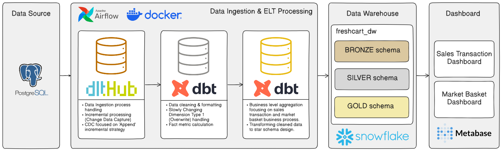
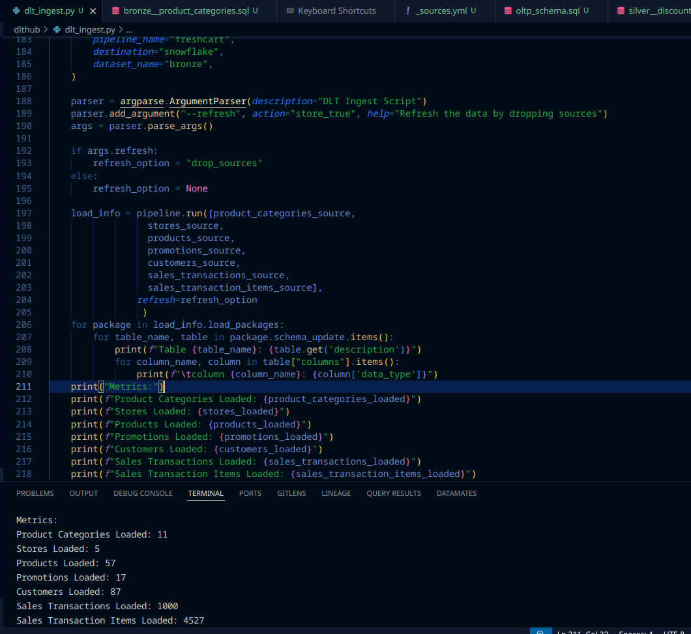
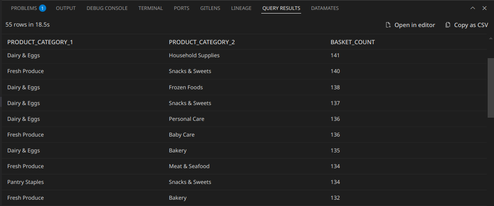

# FreshCart Analytics Pipeline

A comprehensive end-to-end data engineering project for analyzing retail sales transactions and performing market basket analysis using modern data stack technologies.

## 📋 Problem Statement

Business analysts at FreshCart require a robust analytics platform to:
- **Analyze sales transactions** across multiple stores to understand revenue patterns, customer behavior, and product performance
- **Perform product basket analysis** to identify frequently purchased product combinations and uncover cross-selling opportunities
- Enable data-driven decision making through interactive dashboards and reliable data quality monitoring

Currently, the transactional data resides in operational databases without a centralized analytics solution, making it difficult to derive meaningful insights efficiently.

## 🎯 Key Objectives

This project addresses the business needs through the following key objectives:

1. **Data Warehouse Design**:  Implement a multi-layered data warehouse architecture (Bronze → Silver → Gold) following the medallion architecture pattern in Snowflake
2. **Automated Data Pipeline**: Build an orchestrated ELT pipeline using Apache Airflow, DLT (Data Load Tool), and dbt for reliable data ingestion and transformation
3. **Interactive Dashboards**: Create comprehensive Metabase dashboards for: 
   - Sales transaction analysis (revenue trends, store performance, customer insights)
   - Market basket analysis (product associations, cross-selling opportunities)

## 🛠️ Technology Stack

| Category | Tools |
|----------|-------|
| **Source Database** | PostgreSQL |
| **Data Ingestion** | DLT (Data Load Tool) |
| **Data Warehouse** | Snowflake |
| **Data Transformation** | dbt (data build tool) |
| **Orchestration** | Apache Airflow |
| **Visualization** | Metabase |
| **Containerization** | Docker & Docker Compose |
| **Language** | Python 3.x |

## 🏗️ Architecture

The project follows a modern ELT (Extract, Load, Transform) architecture with a medallion design pattern:



**Architecture Components:**
- **Source Layer**: PostgreSQL database containing transactional data
- **Bronze Layer**: Raw data ingestion via DLT into Snowflake
- **Silver Layer**: Cleaned and deduplicated data using dbt staging models
- **Gold Layer**: Business-ready dimensional models (star schema) for analytics
- **Orchestration**:  Airflow manages the entire pipeline workflow
- **Visualization**: Metabase dashboards consume gold layer data marts

## 📊 Dashboards

### Sales Transaction Dashboard
Provides insights into revenue trends, store performance, customer metrics, and product sales analysis.


### Market Basket Analysis Dashboard
Reveals product association patterns and cross-selling opportunities based on co-purchase behavior.


## 🚀 Getting Started

### Prerequisites

- Docker and Docker Compose installed
- Snowflake account with appropriate credentials
- PostgreSQL (included in docker-compose)

### Setup Instructions

#### 1. Environment Configuration

Create a `.env` file in the root directory based on `.env.example`:

```bash
cp .env.example .env
```

Configure the following environment variables in `.env`:

```dotenv
# Airflow Configuration
AIRFLOW_UID=50000
_AIRFLOW_WWW_USER_USERNAME=admin
_AIRFLOW_WWW_USER_PASSWORD=admin

# PostgreSQL Source Database
POSTGRES_HOST=postgres_source
POSTGRES_PORT=5432
POSTGRES_USER=your_username
POSTGRES_PASSWORD=your_password
POSTGRES_DB=freshcart

# Snowflake Data Warehouse
DESTINATION__SNOWFLAKE__CREDENTIALS__ACCOUNT=your_account
DESTINATION__SNOWFLAKE__CREDENTIALS__HOST=your_account.snowflakecomputing.com
DESTINATION__SNOWFLAKE__CREDENTIALS__USERNAME=your_username
DESTINATION__SNOWFLAKE__CREDENTIALS__PASSWORD=your_password
DESTINATION__SNOWFLAKE__CREDENTIALS__DATABASE=FRESHCART_DWH
DESTINATION__SNOWFLAKE__CREDENTIALS__WAREHOUSE=COMPUTE_WH
DESTINATION__SNOWFLAKE__CREDENTIALS__ROLE=ACCOUNTADMIN
DESTINATION__SNOWFLAKE__CREDENTIALS__SCHEMA=bronze

# Runtime Configuration
RUNTIME__LOG_LEVEL=INFO
```

#### 2. Build the Custom Airflow Image

```bash
docker compose build
```

This builds a custom Airflow image with all required dependencies (dlt, dbt, Snowflake connectors, etc.) as specified in the `Dockerfile` and `requirements.txt`.

#### 3. Initialize Airflow Configuration

```bash
docker compose run airflow-cli airflow config list
```

#### 4. Initialize Airflow Database

```bash
docker compose up airflow-init
```

This command initializes the Airflow metadata database and creates the admin user.

#### 5. Start All Services

```bash
docker compose up -d
```

This starts all services in detached mode: 
- Airflow Webserver (http://localhost:8080)
- PostgreSQL (source database)

#### 6. Access Airflow UI

Navigate to `http://localhost:8080` and login with the credentials specified in your `.env` file.

## 📥 Data Ingestion

### Initial Full Refresh Load

The source PostgreSQL database is automatically provisioned through Docker Compose with initial data.  The first pipeline run performs a full historical load:



The DLT ingestion process shows:
- Product categories:  Full load
- Stores: Full load
- Products:  Incremental load with initial full refresh
- Promotions: Full load
- Customers:  Incremental load with initial full refresh
- Sales transactions:  Incremental load (append strategy)
- Sales transaction items:  Incremental load (append strategy)

### Incremental Data Loading (CDC Simulation)

To test incremental processing and validate the CDC (Change Data Capture) append strategy, generate new transactional data:

```bash
docker compose exec airflow-scheduler python /opt/airflow/data_source_setup/incremental_data.py
```

This script simulates new sales transactions being created in the source database. 

### CDC Ingestion Output

Subsequent pipeline runs will process only new/changed records:


The incremental load demonstrates the append strategy, loading only records with `updated_at` timestamps newer than the last processed value.

## 🔄 Data Transformation (dbt)

### dbt Models Lineage

The dbt transformation layer implements a layered approach: 


**Transformation Layers:**
1. **Staging**:  Cleaned and typed source data
2. **Intermediate**:  Business logic and calculations
3. **Marts**: Dimensional models (fact and dimension tables)

## ⚙️ Pipeline Orchestration

### Airflow DAG Workflow

The `freshcart_pipeline` DAG orchestrates the entire ELT process:


**Pipeline Tasks:**

1. **start**: Empty operator marking pipeline start
2. **get_db_source_connection**: Retrieves PostgreSQL connection parameters from environment variables
3. **run_dlt_ingest**: Executes DLT ingestion from PostgreSQL to Snowflake Bronze schema
   - Ingests 7 source tables (product_categories, stores, products, promotions, customers, sales_transactions, sales_transaction_items)
   - Uses incremental loading strategy with `updated_at` cursor for transactional tables
   - Full refresh for dimension tables
4. **dbt_source_freshness**:  Validates source data freshness using dbt
5. **dbt_run_staging**:  Runs staging models to clean and standardize raw data
6. **dbt_run_ints_processing**:  Executes intermediate models for business logic
7. **dbt_run_marts**: Builds final dimensional models (star schema)
8. **dbt_run_quality_tests**:  Runs dbt data quality tests (uniqueness, not null, relationships, etc.)
9. **end**: Empty operator marking pipeline completion

The pipeline runs on a daily schedule (`@daily`) and supports both full refresh and incremental loads. 

## 🗃️ Data Warehouse Schema

### Star Schema (Gold Layer)

The final marts in Snowflake's `gold` schema follow a star schema design:


**Fact Tables:**
- `fact_sales_transaction`: Grain at transaction level with metrics (total_amount, tax_amount, etc.)
- `fact_market_basket`: Product association patterns with support and confidence metrics

**Dimension Tables:**
- `dim_customer`: Customer attributes
- `dim_product`: Product details and hierarchy
- `dim_store`: Store information
- `dim_promotion`: Promotion details
- `dim_date`: Date dimension for time-based analysis

## 🛒 Market Basket Analysis Implementation

The market basket analysis was implemented using a hierarchical approach:

### Step 1: Category-Level Analysis

Initial analysis performed at the product category level to identify broad patterns:



This shows the frequency of category combinations purchased together. 

### Step 2: Threshold Selection

Applied a **1% support threshold** to filter out infrequent category pairs and focus on statistically significant associations. 

### Step 3: Product-Level Analysis

Drilled down to individual product level for detailed basket analysis: 
- Calculated support (frequency of co-occurrence)
- Calculated confidence (conditional probability)
- **Applied minimum count threshold of 3** to eliminate spurious associations from low-volume product pairs

### Final Output

The `fact_market_basket` table contains product pairs meeting the criteria, enabling: 
- Cross-sell recommendations
- Product placement optimization
- Promotion bundle design

## 📈 Data Quality

The pipeline includes comprehensive data quality tests via dbt: 
- **Uniqueness tests**: Ensuring primary keys are unique
- **Not null tests**:  Validating required fields
- **Referential integrity**:  Checking foreign key relationships
- **Accepted values**: Validating enum fields
- **Source freshness**: Monitoring data recency

All tests are executed in the `dbt_run_quality_tests` task and must pass for successful pipeline completion.

## 📝 Project Structure

```
FreshCart-Analytics-Pipeline/
├── airflow/
│   └── dags/
│       └── pipeline.py          # Main Airflow DAG
├── data_source_setup/
│   └── incremental_data.py      # Script to generate incremental data
├── dbt_transformation/          # dbt project folder
│   ├── models/
│   │   ├── staging/            # Staging models
│   │   ├── intermediate/       # Intermediate models
│   │   └── marts/              # Final dimensional models
│   └── tests/                  # Data quality tests
├── dlthub/
│   └── dlt_ingest.py           # DLT ingestion script
├── images/                      # Dashboard and architecture images
├── .env.example                # Environment variables template
├── docker-compose.yaml         # Docker services configuration
├── Dockerfile                  # Custom Airflow image
├── requirements.txt            # Python dependencies
└── README.md                   # This file
```

**Built with ❤️ for the data community**